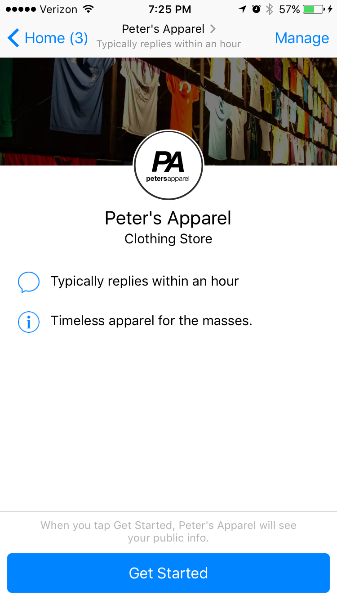

# Facebook Messenger

Integrating your bot with Facebook Messenger is easy, just follow the steps in the wizard!


In order for your Facebook Messenger bot to be publicly available, you will have to go through Facebook's stringent App Review process. You can find steps & best practices for App Review [here](https://developers.facebook.com/docs/apps/review/).


## Facebook Messenger Specific Content

In the `Channels > Messenger` section you can define some settings that are specific to Facebook Messenger.

### Greeting Message

The greeting message is what will first be shown when the bot is opened by a user. In the example below, the greeting message is configure to `Timeless apparel for the masses`.

#### Personalization

You can personalize the greeting text using the person's name. You can use the following template strings:

* `{{user_first_name}}`
* `{{user_last_name}}`
* `{{user_full_name}}`

### Get Started Button

Facebook has a `Get Started` button attached to every page. Clicking on that button routes you to a bot dialog that you can choose here. Typically, this is a bot dialog introducing the bot and what it can do.

### Persistent Menu

Both Facebook and the web widget support an overflow menu that is called the `Persistent Menu`. In this menu, you can define common actions that your users can take. Typical examples include for example

* Start over
* Talk to a live agent
* Disable notifications
* Buy product \[XXX\]
* Go to \[company\] website
* Change Language
* Help

